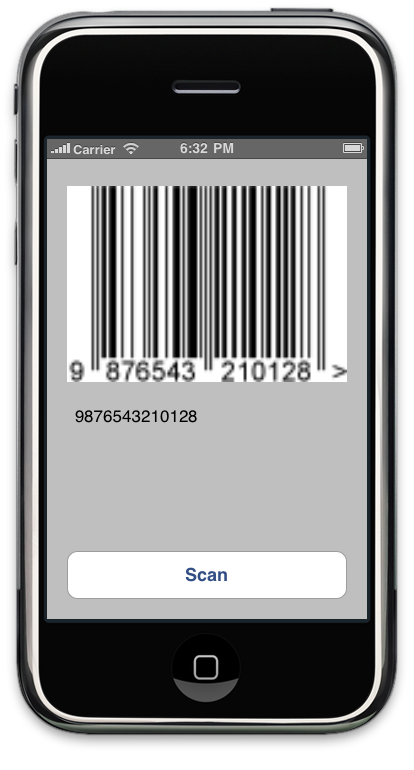

ZBar SDK Integration Tutorial
=============================

This tutorial will quickly get you up and running with the ZBar iPhone SDK.

We will develop a very simple app that presents a button the user can tap to
invoke the barcode reader and then displays the results.  Interface Builder
will be used to create the interface.

The completed project is also available with the distributed SDK under
:file:`Examples/ReaderSample`.

Create the App
--------------

1. Open Xcode; you must have version 4.5.1 or later.

2. Create a new project using the "View-based Application" template.  Name the
   project "ReaderSample".  Save it wherever you like.

3. Open :file:`ReaderSampleViewController.xib`

4. Drag a Round Rect Button onto the view and title it "Scan".  Customize the
   placement and appearance as you like.

5. Drag an Image View onto the view.  Size it to fill about half of the
   remaining space.  Change the view mode to Aspect Fit.

6. Drag a Text View onto the view and size it to fill the remaining space.
   Change the default text to "No barcode scanned" or something.  De-select
   "Editable"

7. Add connections to the interface elements in the code; open
   :file:`ReaderSampleViewController.h` and change the interface to::

      @interface ReaderSampleViewController : UIViewController
      {
          UIImageView *resultImage;
          UITextView *resultText;
      }
      @property (nonatomic, retain) IBOutlet UIImageView *resultImage;
      @property (nonatomic, retain) IBOutlet UITextView *resultText;
      - (IBAction) scanButtonTapped;
      @end

8. Now we can finish the interface connections - open
   :file:`ReaderSampleViewController.xib` and make these connections:

   * Connect ReaderSampleViewController ``resultImage`` outlet to the
     ImageView.
   * Connect ReaderSampleViewController ``resultText`` outlet to the TextView.
   * Connect ReaderSampleViewController ``scanButtonTapped`` action to the
     RoundedRectButton(Scan) event ``TouchUpInside``.

   Consult the Xcode documentation if you need help making these connections.
   Make sure you save the XIB once they are finished.

9. Finish the implementation in :file:`ReaderSampleViewController.m`::

      @synthesize resultImage, resultText;
      
      - (IBAction) scanButtonTapped
      {
          NSLog(@"TBD: scan barcode here...");
      }
      
      - (void) dealloc
      {
          self.resultImage = nil;
          self.resultText = nil;
          [super dealloc];
      }
      
      - (BOOL) shouldAutorotateToInterfaceOrientation: (UIInterfaceOrientation) interfaceOrientation
      {
          return(YES);
      }

   This stub for scanButtonTapped is temporary, we'll fix it in a minute...

Although it doesn't do much yet, you should now have a working skeleton app
that you can build and run.

Integrate the Reader
--------------------

Now for the exciting part - let's add a barcode reader!

1. If you have not done so already, download the latest SDK from
   http://zbar.sourceforge.net/iphone

2. Double-click the disk image, ZBarSDK-|version|.dmg in the Finder to open it.

3. Drag the :file:`ZBarSDK` folder into your Xcode project.  Make sure that
   the "Copy Items into destination group's folder" checkbox is checked.

4. Open the target build settings and find ``Link Binary With Libraries``.
   Click the ``+`` and add each of these (NB hold down command for multiple
   selection):

   * AVFoundation.framework
   * CoreMedia.framework
   * CoreVideo.framework
   * QuartzCore.framework
   * libiconv.dylib

   .. warning::

      Link order may be important for some versions of Xcode; the libraries
      referenced above should be listed *before* :file:`libzbar.a` in the
      link order.

5. Import the SDK header.  You will usually want to prefix it, so add it to
   :file:`ReaderSample-prefix.pch`::

      // ADD: import barcode reader APIs
      #import "ZBarSDK.h"

6. Declare support for the delegate protocol in
   :file:`ReaderSampleViewController.h`::

      @interface ReaderSampleViewController : UIViewController
          // ADD: delegate protocol
          < ZBarReaderDelegate >
      {
      ...

7. Re-implement scanButtonTapped to present a barcode reader when the user
   taps the Scan button.  In :file:`ReaderSampleViewController.m`::

      - (IBAction) scanButtonTapped
      {
          // ADD: present a barcode reader that scans from the camera feed
          ZBarReaderViewController *reader = [[ZBarReaderViewController alloc] init];
          reader.readerDelegate = self;
          reader.supportedOrientationsMask = ZBarOrientationMaskAll;
      
          ZBarImageScanner *scanner = reader.scanner;
          // TODO: (optional) additional reader configuration here
      
          // EXAMPLE: disable rarely used I2/5 to improve performance
          [scanner setSymbology: ZBAR_I25
                   config: ZBAR_CFG_ENABLE
                   to: 0];
      
          // present and release the controller
          [self presentModalViewController: reader
                animated: YES];
          [reader release];
      }

8. Finally, implement the delegate method to do something useful with the
   results.  Still in :file:`ReaderSampleViewController.m`::

      - (void) imagePickerController: (UIImagePickerController*) reader
       didFinishPickingMediaWithInfo: (NSDictionary*) info
      {
          // ADD: get the decode results
          id<NSFastEnumeration> results =
              [info objectForKey: ZBarReaderControllerResults];
          ZBarSymbol *symbol = nil;
          for(symbol in results)
              // EXAMPLE: just grab the first barcode
              break;
      
          // EXAMPLE: do something useful with the barcode data
          resultText.text = symbol.data;
      
          // EXAMPLE: do something useful with the barcode image
          resultImage.image =
              [info objectForKey: UIImagePickerControllerOriginalImage];
      
          // ADD: dismiss the controller (NB dismiss from the *reader*!)
          [reader dismissModalViewControllerAnimated: YES];
      }

And that's it!

Testing
-------

1. Save everything (don't forget to save MyAppViewController.xib).

2. Build and Run the project.

3. Tap the Scan button.

4. Aim at barcode.

5. Enjoy the sweet fruits of your minimal labor

Where to go from here
---------------------

You can learn more about using the reader APIs to scan barcodes from
:doc:`camera` or :doc:`picker`.  Use the :doc:`apiref` to find details about a
particular interface.

Troubleshooting
---------------

We take great care to ensure this tutorial is working as described.  However,
if you do have a problem

1. Make sure you followed the instructions exactly - every detail is
   important.
2. Start from scratch with a new project and follow the instructions
   *exactly*.
3. Try the ReaderSample distributed with the SDK and compare your work with
   that.
4. If you are unable to get things working, you may post your frustrations in
   the project `iPhone Developers Forum`_.  Please be very specific about your
   problem, post the complete text of any errors, etc.

.. _`iPhone Developers Forum`:
   http://sourceforge.net/projects/zbar/forums/forum/1072195
